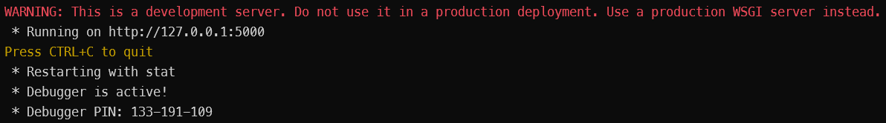
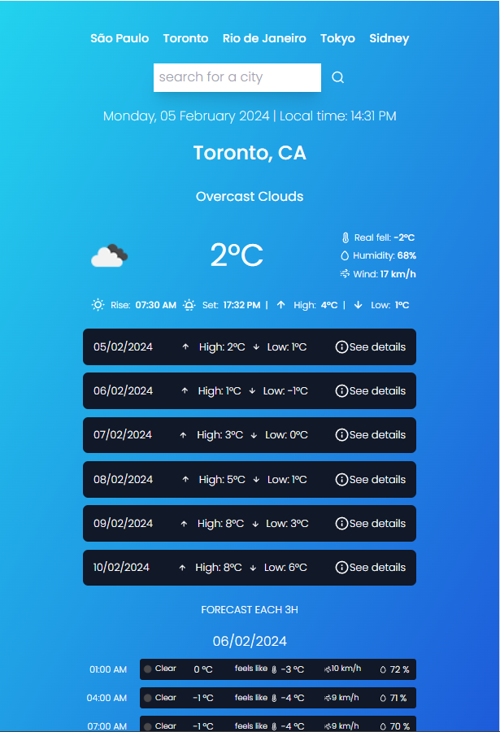
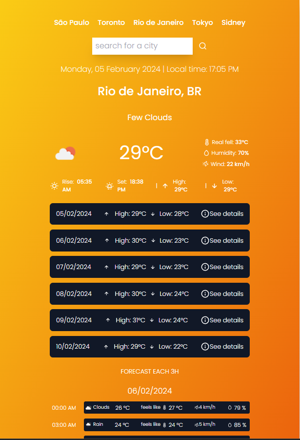

## COMO TESTAR

## Parte 1 - Iniciando o servidor do backend

1.1) Instale primeiramente o python. Se já tiver instalado, utilize `python3 --version` para checar a versão. Se não, instale a última versão 3.x de https://www.python.org/

1.2) Verifique se o package manager PIP está instalado com o comando `python3 -m pip --version`. Se não, siga as instruções em https://packaging.python.org/en/latest/tutorials/installing-packages/#

1.3) Iniciar o ambiente virtual executando o seguinte comando na pasta /backend `source weather-forecast-app-env/bin/activate`

1.4) Instalar as dependencias necessárias na mesma pasta conforme o comando abaixo, utilizando o gerenciador de pacotes PIP.

`pip install -r requirements.txt`

Os outros módulos utilizados (os, json, datetime, sqlite3) necessários para o projeto já estão inclusos na biblioteca padrão do pyhton.

1.5) Finalmente, Para testar o backend basta rodar o comando 'python3 app.py' dentro da pasta /backend, que será iniciado o servidor na porta 5000.



## Parte 2 - Iniciando o servidor do frontend

2.1) Vá até a pasta /frontend do projeto e execute `npm install` para instalar as dependências existentes no package.json (moment, iconscout, react, tailwind, etc. )

2.2) Na pasta /frontend execute o comando `npm start`. O servidor será iniciado na porta 3000. Navegue até `http://localhost:3000/` no seu navegador e o aplicativo deve ser iniciado. Agora basta testar buscando cidades desejadas.

 

## DETALHES DA CONSTRUÇÃO DA APLICAÇÃO

## Descrição de como foi construir o backend em Python

1 - Instalação do PIP package manager e do framework Flask

Instalei o PIP package manager e utilizei o framework Flask para criar as rotas de API. Também é necessário iniciar o ambiente virtual que criei com o comando na pasta backend `source weather-forecast-app-env/bin/activate`

2 - Chamada às APIs da OpenWeatherMap

No arquivo app.py criei duas chamadas nas APIs da https://openweathermap.org/, uma para a API de 5 dias/3 em 3 horas e outra para as informações de tempo do instante atual.

3 - Criação de um dicionário com os dados da API

Executando essas duas chamadas foi criado um dicionário weather com os dados que a aplicação necessita. Os dados foram tratados no arquivo api_calls.py, transformando o retorno original da API em um retorno mais adequado para se trabalhar depois no frontend. O formato do retorno transformado é:.

```weather = {
        "city": forecast_data["city"]["name"],
        "country": forecast_data["city"]["country"],
        "current_weather": current_weather_treated_data,
        "forecast": grouped_by_day_forecast_data,
    }
```

4 - Criação do banco de dados SQLite

Criei o arquivo `database.py`, o qual cria a tabela no banco sqLite com os dados de tempo do instante atual da busca na API e os dados retornados da API.

5 - Criação das rotas de API

Foram então criadas duas rotas utilizando o Flask, uma `/search` com input de parametro com a cidade que deseja buscar e armazena os dados na tabela `'weather'` do banco de dados e a outra `/history` que busca no banco de dados o histórico que foi salvo nas buscas anteriores.

## Descrição de como foi construir o frontend com React e Javascript

1 - Utilização do create-react-app

Utilizei a base de projeto react `npx create-react-app .`, com o comando que fornece já uma estrutura e instala módulos como o `react`, `react-dom` e `react-script` para testar a aplicação em tempo real.

2 - Criação dos componentes

Foram criados 7 componentes dentro da pasta components. Na ordem: TopButtons, Inputs, TimeAndLocation, TemperatureAndDetails, Forecast e DayCard.

    - TopButtons: Botões com placeholders de algumas cidades. Ao clicar o componente executa setCity("nome da cidade escolhida") e altera o estado "city", fazendo com que seja executado o hook useEffect que executa então a chamada na rota /search?city="nome da cidade".

    - Inputs: Barra de busca que, ao clicar na lupa, executa a chamada na API assim como o componente TopButtons.

    - TimeAndLocation: Informação da cidade atual sendo pesquisada e horário local dessa cidade.

    - TemperatureAndDetails: Informa detalhes do tempo no instante atual da busca.

    - Forecast: Informa os detalhes de previsão do tempo para os próximos dias. Ao clicar, exibe detalhes no componente DayCard.

    - DayCard: Informa os detalhes da previsão do tempo para o dia selecionado, informando a previsão em um intervalo a cada 3h.

3 - Os componentes foram então renderizados no App.js, sendo feitas iterações para repetir a exibição do componente para dados em arrays, como a lista de dias da previsão do tempo e os detalhes da previsão para cada dia.

4 - Foram utilizados ícones da dependencia "iconscout" e a estilização feita com tailwind css.
